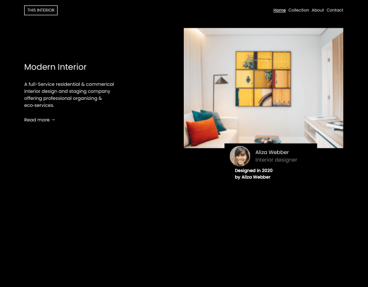

<h1 align="center">Interior Consultant</h1>

   Solution for a challenge from  <a href="http://devchallenges.io" target="_blank">Devchallenges.io</a>.

  <h3>
    <a href="https://jdegand.github.io/interior-consultant">
      Live Link
    </a>
     | 
    <a href="https://devchallenges.io/challenges/Jymh2b2FyebRTUljkNcb">
      Challenge
    </a>
  </h3>

## Table of Contents

- [Overview](#overview)
  - [Built With](#built-with)
- [Features](#features)
- [Useful Resources](#useful-resources)

## Overview

Used gap with flexbox on the navbar vs adding margin on ul > *. 

Adding the id to the nav for accessibility caused specificity issue when hiding the nav items. 

Would have been much easier to give the card a fixed width and height.  

Need to look more into semantic html for cards.

If you change the card div wrapper to a section, the css breaks and the card is not overlapping the image.  

### Built With

- HTML
- CSS
- JS

## Features

This application/site was created as a submission to a [DevChallenges](https://devchallenges.io/challenges) challenge. The [challenge](https://devchallenges.io/challenges/Jymh2b2FyebRTUljkNcb) was to build an application to complete the given user stories.

## Useful Resources

- [Steps to replicate a design with only HTML and CSS](https://devchallenges-blogs.web.app/how-to-replicate-design/)
- [Unicode Table](https://unicode-table.com/en/1F812/) - left arrow
- [W3](https://www.w3.org/WAI/tutorials/menus/structure/) - accessible menu
- [Micro Formats](http://microformats.org/wiki/h-card) - micro formats
- [Stack Overflow](https://stackoverflow.com/questions/40088620/semantic-html-for-a-business-card) - semantic html for business card
- [YouTube](https://www.youtube.com/watch?v=HbBMp6yUXO0) - responsive nav tutorial
- [Stack Overflow](https://stackoverflow.com/questions/39056537/why-don-t-svg-images-scale-using-the-css-width-property) - svg not scaling
- [Stack Overflow](https://stackoverflow.com/questions/20953342/first-of-type-css-selecting-everything) - first-of-type
- [Stack Overflow](https://stackoverflow.com/questions/8753296/how-to-prevent-line-break-at-hyphens-in-all-browsers) - cause hypenated word to wrap to new line
- [Smashing Magazine](https://www.smashingmagazine.com/2009/07/the-definitive-guide-to-using-negative-margins/) - negative margins
